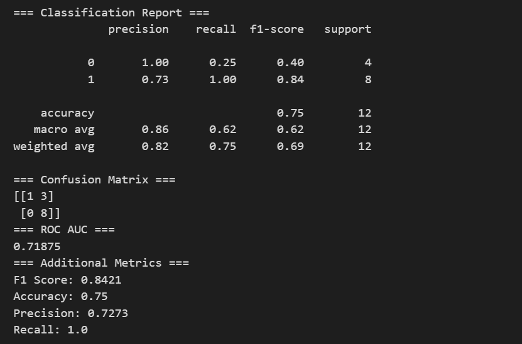

# Sleep Behavior Analysis on T2DM using AI-READI Dataset (v3.0.0)

## Project Overview

This project explores whether **sleep behavior patterns derived from wearable device data** show distinguishable differences between diabetic and non-diabetic individuals.

Using the **AI-READI Dataset (v3.0.0)**, sleep stage data was processed and transformed into **patient-level behavioral features**, which were then used to train machine learning models for **exploratory classification analysis**.

The goal is **not clinical prediction**, but to investigate whether **sleep characteristics contain useful signals related to metabolic health**.

---

## 🌐 Live Dashboard

👉 **Streamlit App:**  
https://sleept2dmai-readai-dataset-vae2nnpwfzrts6jrrsb7xl.streamlit.app/

> ⏳ *Note: App may take a few seconds to load (hosted on Streamlit Cloud)*
---

# Dataset

The dataset used in this study comes from the **AI-READI Dataset (v3.0.0)**.

## Initial Dataset

The dataset initially contained:

* **100 patients**

Each patient had wearable sleep recordings consisting of **multiple sleep stage segments per night**.

### Example structure of the raw dataset

| patient_id | sleep_stage | start_time       | end_time         |
| ---------- | ----------- | ---------------- | ---------------- |
| 1029       | light       | 2023-09-08T04:21 | 2023-09-08T05:06 |
| 1029       | deep        | 2023-09-08T05:06 | 2023-09-08T05:42 |

Each night contained multiple sleep segments such as:

```
Light → Deep → REM → Light → REM
```

---

# Data Filtering

To ensure stable feature computation, only patients with **at least 7 days of sleep records** were included.

After filtering:

* **Final dataset size:** 60 patients

### Class Distribution

* **Diabetic:** 38
* **Non-Diabetic:** 22

---

# Machine Learning Pipeline

```
Raw Sleep Data
      │
      ▼
Data Filtering (≥7 days)
      │
      ▼
Feature Engineering
(patient-level aggregation)
      │
      ▼
Feature Selection
(Boxplots + Correlation + Mann–Whitney U Test)
      │
      ▼
Model Training
(Logistic Regression, Random Forest, SVM, KNN)
      │
      ▼
Hyperparameter Tuning
(GridSearchCV)
      │
      ▼
Cross Validation
(Repeated Stratified K-Fold)
      │
      ▼
Final Model Evaluation
(ROC-AUC, Confusion Matrix, Classification Report)
```

---

# Feature Engineering Pipeline

The raw sleep segment data was transformed through multiple steps.

## 1️⃣ Segment Duration Calculation

Sleep segment duration was computed as:

```
duration = end_time − start_time
```

---

## 2️⃣ Daily Sleep Aggregation

Sleep segments were aggregated into **daily sleep summaries**, including:

* Total sleep hours
* Deep sleep duration
* REM sleep duration
* Light sleep duration
* Awake duration

---

## 3️⃣ Patient-Level Feature Extraction

Daily sleep data was further aggregated into **patient-level behavioral features**.

### Initially Explored Features

* Mean sleep duration
* Sleep variability
* Percentage of short sleep (<6 hours)
* Percentage of long sleep (>9 hours)
* Sleep range
* Number of recorded days
* Deep sleep percentage
* REM sleep percentage
* Light sleep percentage
* Awake percentage

### Feature Selection

To identify the most informative features:

* Distribution plots and **boxplots** were analyzed
* **Mann–Whitney U statistical tests** were applied
* **Correlation analysis** removed redundant features
* Multiple **feature combinations were tested through model training**

---

## Final Selected Features

Three features were finalized:

**Sleep variability (`std_sleep`)**
Captures irregular sleep patterns linked to metabolic dysregulation.

**Percentage of long sleep nights (`pct_long`)**
Long sleep duration has been associated with increased metabolic risk.

**REM sleep proportion (`pct_rem`)**
REM sleep plays an important role in metabolic and neurological regulation.

Different combinations of these features were tested to evaluate their effect on model performance.

---

# Machine Learning Models

Several classifiers were evaluated:

* Logistic Regression
* Random Forest
* Support Vector Machine (SVM)
* K-Nearest Neighbors (KNN)

Hyperparameter tuning was performed using:

**GridSearchCV + Repeated Stratified K-Fold cross-validation**

---

# Best Model

The best performing model was:

**Support Vector Machine (RBF Kernel)**

Cross-validation performance:

```
Mean ROC-AUC ≈ 0.75
```

---

# Final Evaluation

### Test Set Results

| Metric    | Score   |
| --------- | ------- |
| Accuracy  | 0.75    |
| F1 Score  | 0.84    |
| ROC-AUC   | 0.71875 |
| Precision | 0.727   |
| Recall    | 1.00    |

---

## Model Output


---

# Interpretation

Results suggest that **sleep variability and REM sleep patterns may contain signals related to metabolic health**.

However, this analysis is **exploratory** and limited by **dataset size**.

---

# How to Run the Project

Follow these steps to reproduce the analysis.

## 1️⃣ Clone the Repository

```bash
git clone https://github.com/Tushika2024/Sleep_T2DM_AI-readai-dataset.git
cd Sleep_T2DM_AI-readai-dataset
```

---

## 2️⃣ Install dependencies

```bash
pip install -r requirements.txt
```

---

## 3️⃣ Open the Notebook

```bash
jupyter notebook
```

Then open:

```
sleep_calender_date.ipynb
```

---

## 4️⃣ Run the Analysis

Execute the notebook cells sequentially to perform:

* Data preprocessing
* Feature engineering
* Statistical feature selection
* Machine learning model training
* Model evaluation

---

## 5️⃣ Run Streamlit App
streamlit run app.py

---

# Future Work

Future improvements may include:

* Combining **sleep + glucose monitoring signals**
* Adding **clinical variables**
* Using **retinal imaging data**
* Developing **multimodal models**

This may help build more comprehensive models for metabolic health research.

---

# Tools Used

* Python
* Pandas
* NumPy
* Scikit-learn
* Matplotlib
* Seaborn
* Streamlit

